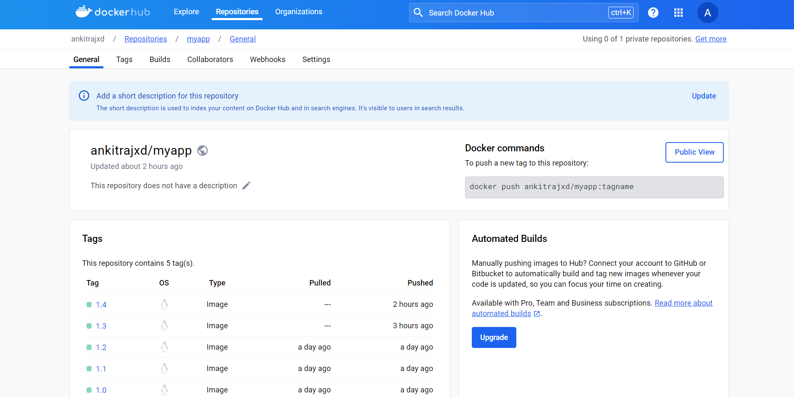
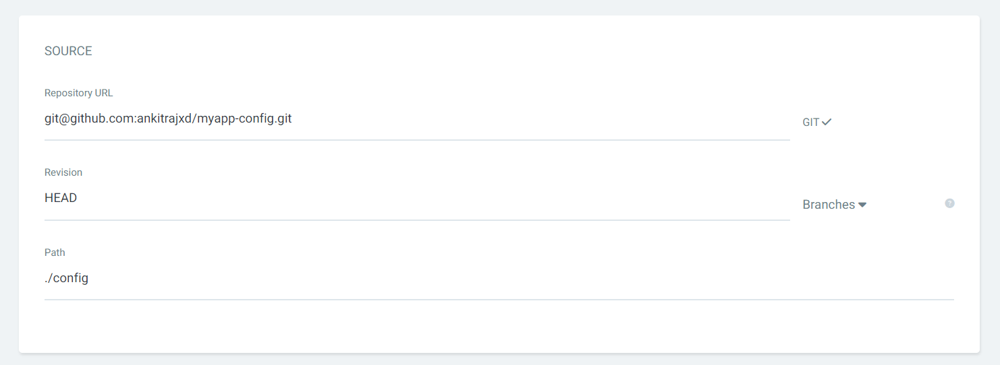
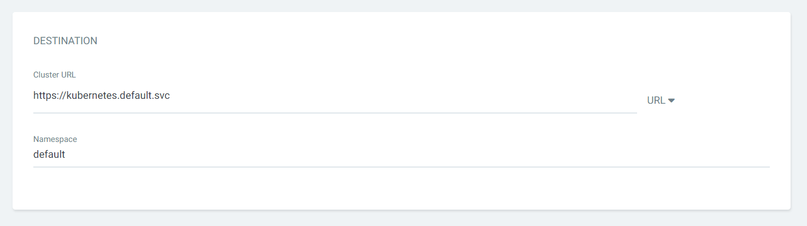
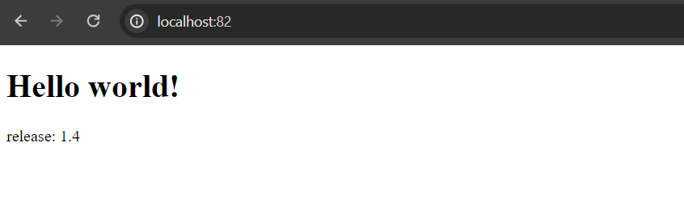
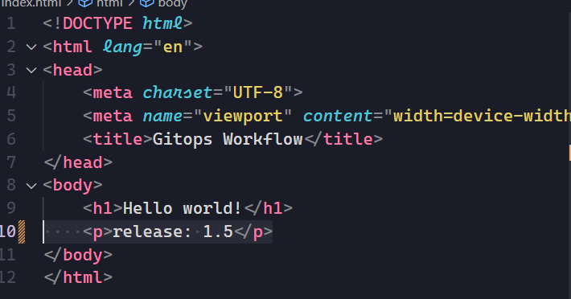
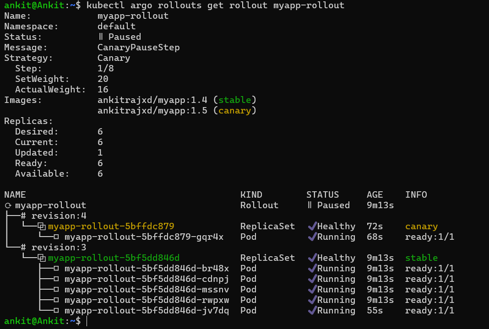

# GitOps Pipeline for Continuous Deployment with Argo CD and Argo Rollouts

This repository contains the setup and configuration for implementing a GitOps pipeline utilizing Argo CD for continuous deployment and Argo Rollouts for advanced deployment strategies within a Kubernetes environment.

## Prerequisites
- Docker installed for creating docker images.
- A Kubernetes cluster accessible for testing. (we will be using a local Kubernetes cluster)


# Steps
Follow these steps to set up this GitOps pipeline:

1. **Initialize the Repository:**
    ```bash
    git init
    ```

2. **Creating K8s cluster:**
    - For this use case, we will be using a local cluster. You can choose a managed cluster as well.

    - We will set up the Kubernetes cluster via Docker Desktop. You can use `Minikube` also.
    
    - To start the cluster using Docker Desktop, ensure Docker Desktop is installed on your machine and [enable](https://docs.docker.com/desktop/kubernetes/) the option to start the Kubernetes cluster on Docker Desktop startup.

3. **Configure Argo CD:**
    - To install Argo CD in the Kubernetes cluster:

        ```bash
        kubectl create namespace argocd

        kubectl apply -n argocd -f https://raw.githubusercontent.com/argoproj/argo-cd/stable/manifests/install.yaml

        kubectl patch svc argocd-server -n argocd -p '{"spec": {"type": "LoadBalancer"}}'
        ```
    - Argo CD will be available at `localhost:80`. Use the initial username `admin` and retrieve the password from the secret object in the `argocd` namespace:
        ```bash
        kubectl get secret -n argocd

        kubectl -n argocd get secret argocd-initial-admin-secret -o jsonpath="{.data.password}" | base64 -d
        ```

4. **Install Argo Rollouts:**
    - To install Argo Rollouts, [follow](https://argoproj.github.io/argo-rollouts/installation/) the steps provided in the official documentation.

5. **Creating a Simple Web App and Docker Image:**
    - Create a simple web app using HTML, mentioning a "hello world" and a release number to track which version is currently showing to users.
   
    - Create a Dockerfile to create a Docker image out of it and push it to Docker Hub. (dockerfile Provided in this repository)

        - To Create a dockerimage from docker file use 
            ```
            docker build -t myapp:1.0 .
            ```
        - To push a dockerimage to docker registry
            ```
            docker push myapp:1.0
            ```

            
            
>  **Note:**  Before pushing the image to docker registry, you need to create a repository on dockerhub and tag the image with same respository name.

6. **Deploy with Argo CD:**
    - Create a YAML file for the web application to deploy in the Kubernetes cluster using Argo CD. Instead of using traditional deployment file, we are going to use argocd rollout crd which allow us to define custom rollout strategy for our application. (To use argo crd, change the `apiVersion: argoproj.io/v1alpha1` and `kind: Rollout`)
        
        (provided in `/config/myapp.yaml`)

    - After creating yaml file commit and push it to github.

    - Access Argo CD at `http://localhost:80`.
    - Click on "Create Application".
    - Provide the following details:

        - Project: Select a project (or create a new one)
        - Name: Set a name for your application (e.g., myapp)
        - Repository URL: Provide the URL of your Git repository.

          
        - Path: Leave this blank or set it to the path of your YAML file within the repository (In this case, yaml file is stored in `./config` folder)

            
        - Cluster: Select the appropriate Kubernetes cluster ( In this case it's `https://kubernetes.default.svc`) and the namespace in which our web app will get deployed.

            

    - Click "Sync" to allow Argo CD to detect the deployment manifest and apply it to your cluster.

    - Argo CD should automatically deploy your application. You can verify this by:

        - Using `kubectl get pods` to see if pods for your application have been created.
        - Accessing the application service port (e.g., `http://localhost:82`)

            


7. **Implement Canary Release with Argo Rollouts:**
    - Modify the Deployment YAML to use Argo Rollouts. by adding below section, we define a custom rollout strategy for our web application.

        ```yaml
            ...
            spec:
            replicas: 6 
            strategy:
                canary:
                steps:
                - setWeight: 20 # Gradually increase weight (traffic) for the new version
                - pause: {} # Wait indefinitely until the release is promoted manually
                - setWeight: 40
                - pause: {}
                - setWeight: 60
                - pause: {duration: 10} # Wait for 10 seconds
                - setWeight: 80
                - pause: {duration: 10}
                ...
        ```
    - Push this updated YAML to your Git repository.
    - Argo CD will detect the changes and initiate a canary rollout process according to the defined strategy.
    - You can monitor the rollout progress using `kubectl argo rollouts get rollout myapp-rollout` command.
    

8. **Trigger a Rollout:**
    - Make changes to the application (`Change the release text in html file and bump it to next version.`), update the Docker image, and push the changes to docker registry.

        

    - Update the image version of application in yaml file of the web application and then push it to git repository.

        

    - Argo Rollouts will detect the changes and initiate a rollout process.

   
---

### Here's what happens after you make changes to  application, update the Docker image, and push the changes to your repository:

* **Change Detection:**

    Argo CD Watch: Thanks to the continuous monitoring nature of Argo CD, it will automatically detect the updated application manifest in your Git repository after the push.

* **Rollout Initiation:**

    Strategy Processing: Argo CD will analyze the specified strategy from deployment file of application(i.e, canary) and initiate the rollout process based on the defined steps.

* **Gradual Traffic Shift:**

    Argo Rollouts will begin shifting traffic to the new version in a controlled manner, following the weight percentages (e.g., setWeight) and pausing durations (e.g., pause) defined in the rollout section of YAML file.

    

    *This allows for testing the new version with a small portion of user base (canary) before promoting it to everyone.*

* **Promotion:**
    
    If everything goes smoothly and you are satisfied with the new version's performance, you can manually promote it to stable using the command:

    ```bash
    kubectl argo rollouts promote myapp-rollout
    ```

    

* **Rollout Completion:** 
    
    Once the rollout reaches 100% traffic weight (e.g., setWeight: 100) and a defined waiting period (e.g., pause: {duration: 10} for monitoring) elapses without any significant issues detected, the rollout is considered complete.


---
## Resource cleanup

**Method 1: Using Argo CD UI:**

1. Access Argo CD: Open the Argo CD web interface at http://localhost:80.
2. Select Application: Navigate to the application you want to clean up.
3. Delete Application: Click on the "Delete" button and confirm the deletion.

*This action will automatically cascade and remove all resources associated with the application that Argo CD manages.*

**Method 2: Using kubectl:**

* Identify Resources: Use the following command to list all resources in your cluster associated with the Argo CD application:
    ```
    kubectl get all -n argocd
    kubectl get all -n argo-rollouts
    ```

    
* Delete Resources: You can selectively delete individual resources using the kubectl delete command:
    ```bash
    kubectl delete deployment <deployment-name> -n <desiredNamespace>
    kubectl delete service <service-name> -n <desiredNamespace>
    # ... and so on for other resources
    ```
----
## Potential Challenges with this GitOps Pipeline

**1. Managing Multiple Applications:** 
    As the number of applications you manage through the pipeline increases, maintaining and synchronizing their configurations can become complex.

Potential Solution - Start with a Simple Setup: Begin with a single application and gradually scale up as you gain confidence and experience.

**2. Visibility into Rollouts:**

Tracking the progress and health of rollouts, especially during canary deployments, can require additional monitoring tools or integrations.

Potential Solution - Integrate tools like Prometheus and Grafana to monitor application health and track rollout progress.